# JavaWeb-Servlet-Learning
✨ 初心者向けJavaWeb Servletの核心知識を体系的に学ぶためのリポジトリです。環境構築から実践例まで完全なチュートリアルを含みます。

## 📚 学習内容
- Servlet基礎：ライフサイクル、核心メソッド（init/doGet/doPost/destroy）
- アノテーション設定：@WebServletアノテーションの使用とパスマッピング
- デプロイ実践：IDEA + Tomcat 11（Jakarta EE）によるServletプロジェクトのデプロイ
- トラブルシューティング：404エラー/ポート占用/デプロイ失敗などの常見問題の解決策
- 核心API：HttpServletRequest/HttpServletResponseの使用方法

## 🛠 環境設定
- JDK：17+（Jakarta EE 10に対応）
- サーバー：Apache Tomcat 11.0.18
- 開発ツール：IntelliJ IDEA
- 規格：Jakarta Servlet 6.0

## 📝 実践例
- 基礎的なHelloWorld Servlet（アノテーション/XMLの2通りの設定方式）
- リクエストパラメータの取得とレスポンスデータの返却
- Servletコンテキストとセッション管理

## ❓ 常見問題
学習過程で遭遇した典型的な問題を記録しています：
- Tomcatデプロイ後の404エラーのトラブルシューティング
- 8080ポート占用の解決策
- Jakartaと伝統的なjavax.servletの互換性対応


## 学习笔记

一个Servlet的生命周期为：

首先执行构造方法完成 Servlet 初始化
Servlet 初始化后调用 init () 方法。
Servlet 调用 service() 方法来处理客户端的请求。
Servlet 销毁前调用 destroy() 方法。
最后，Servlet 是由 JVM 的垃圾回收器进行垃圾回收的。


我们发现service方法中，还有两个参数，ServletRequest和ServletResponse，
实际上，用户发起的HTTP请求，就被Tomcat服务器封装为了一个ServletRequest对象，
我们得到是其实是Tomcat服务器帮助我们创建的一个实现类，HTTP请求报文中的所有内容，
都可以从ServletRequest对象中获取，同理，ServletResponse就是我们需要返回给浏览器的HTTP响应报文实体类封装。


## @WebServlet(value = "/test",loadOnStartup = 1) loadOnstartup 参数的作用 

你问的 `loadOnStartup = 1` 是 `@WebServlet` 注解里非常实用的配置项，核心作用是**改变 Servlet 的初始化时机**，我会用通俗易懂的方式帮你讲清楚它的作用、用法和实际价值。

### 1. 先理解「默认情况」（不加 loadOnStartup）
如果不配置这个参数，Tomcat 启动时**不会初始化你的 Servlet**，而是要等：
- 客户端第一次访问 `/test` 这个路径时，Tomcat 才会创建 Servlet 实例 → 执行 `init()` 方法 → 处理请求。
- 缺点：第一次访问会有明显延迟（因为要初始化），如果 Servlet 的 `init()` 里有耗时操作（比如加载配置、连接数据库），第一次请求会很慢甚至超时。

### 2. loadOnStartup 的核心作用
`loadOnStartup` 是一个**整数参数**，它会告诉 Tomcat：
> 「启动的时候就把这个 Servlet 初始化好，不要等第一次请求才弄！」

具体规则：
- **值 ≥ 0**：Tomcat 启动时就创建 Servlet 实例，执行 `init()` 方法，Servlet 进入「就绪状态」，等待请求；
- **值 < 0**（默认，不配置就是 -1）：按默认规则，第一次请求时才初始化；
- **多个 Servlet 有该参数**：数值越小，初始化优先级越高（比如 `loadOnStartup=1` 比 `=2` 先初始化）；
- **值相同**：初始化顺序由 Tomcat 决定（不保证）。

### 3. 代码示例 + 效果对比
#### 你的代码（加了 loadOnStartup = 1）
```java
@WebServlet(value = "/test", loadOnStartup = 1)
public class TestServlet extends HttpServlet {
    @Override
    public void init() throws ServletException {
        // 模拟耗时初始化：加载配置、连接数据库等
        System.out.println("TestServlet 初始化完成！");
    }

    @Override
    protected void doGet(HttpServletRequest req, HttpServletResponse resp) throws ServletException, IOException {
        resp.getWriter().write("Hello Test!");
    }
}
```

#### 效果：
- 启动 Tomcat 时，控制台立刻打印 `TestServlet 初始化完成！`；
- 第一次访问 `http://localhost:8080/xxx/test` 时，直接返回结果，无初始化延迟。

#### 不加 loadOnStartup 的效果：
- 启动 Tomcat 时，控制台无打印；
- 第一次访问 `/test` 时，先打印 `TestServlet 初始化完成！`，再返回结果（有延迟）。

### 4. 实际应用场景（什么时候用）
- ✅ **Servlet 初始化有耗时操作**：比如加载配置文件、初始化数据库连接池、预加载缓存等；
- ✅ **核心业务 Servlet**：保证用户第一次访问不卡顿，提升体验；
- ❌ 非核心/极少访问的 Servlet：没必要提前初始化，浪费内存。

### 总结
1. `loadOnStartup = 1` 让 Servlet 在**Tomcat 启动时就完成初始化**，而非第一次请求时；
2. 数值 ≥ 0 生效，数值越小优先级越高，解决「第一次访问卡顿」问题；
3. 适合初始化有耗时操作的核心 Servlet，非核心 Servlet 无需配置（用默认 -1 即可）。

简单记：`loadOnStartup` 就是「启动时加载」，数值是优先级，核心 Servlet 配 1/2 即可。


## 上传文件的路径为什么不能是文件夹

你现在遇到的核心问题是：把文件上传的目标路径设成了**文件夹**（`/Users/xuyaochen/FuRiIT/project/WebTest/src/main/resources`），但 `FileOutputStream` 要求必须指定**具体的文件名称**，而不是文件夹，所以抛出了 `FileNotFoundException` 异常。

### 为什么路径不能是文件夹？
`FileOutputStream` 的核心作用是**写入「文件」**，而不是「文件夹」：
- 当你传入一个文件夹路径时，JVM 会认为你要把数据直接写入这个文件夹（而非文件夹里的某个文件），但文件夹本身是「容器」，不是可写入的文件，因此系统会报错「Is a directory」（是一个目录）。
- 举个通俗的例子：你想把文件放到抽屉里（文件夹），但必须指定「放到抽屉里的某张纸」（具体文件），而不能直接把内容写在抽屉本身上。

### 修复代码（核心：拼接「文件夹+具体文件名」）
我帮你修改代码，既指定文件夹路径，又自动获取上传文件的原始名称，确保写入到具体文件中：
```java
protected void doPost(HttpServletRequest req, HttpServletResponse resp) throws ServletException, IOException {
    // 1. 解决中文乱码
    req.setCharacterEncoding("UTF-8");
    resp.setContentType("text/html;charset=UTF-8");

    // 2. 定义文件保存的「文件夹路径」（确保这个文件夹已存在！）
    String saveDir = "/Users/xuyaochen/FuRiIT/project/WebTest/src/main/resources/";
    // 检查文件夹是否存在，不存在则创建
    File dir = new File(saveDir);
    if (!dir.exists()) {
        dir.mkdirs(); // 递归创建多级文件夹
    }

    try {
        // 3. 获取上传的文件部件（对应前端input的name="test-file"）
        Part part = req.getPart("test-file");
        // 4. 获取上传文件的原始名称（比如 "test.png"）
        String fileName = part.getSubmittedFileName();
        // 防止空文件名（比如用户没选文件就提交）
        if (fileName == null || fileName.isEmpty()) {
            resp.getWriter().write("请选择要上传的文件！");
            return;
        }

        // 5. 拼接「文件夹路径 + 文件名」，得到完整的文件路径（关键！）
        String fullFilePath = saveDir + fileName;
        // 6. 写入到具体文件（而非文件夹）
        try (FileOutputStream stream = new FileOutputStream(fullFilePath)) {
            IOUtils.copy(part.getInputStream(), stream);
            resp.getWriter().write("文件上传成功！保存路径：" + fullFilePath);
        }
    } catch (Exception e) {
        resp.getWriter().write("文件上传失败：" + e.getMessage());
        e.printStackTrace();
    }
}
```

### 关键补充说明
1. **必须确保文件夹存在**：
   如果 `src/main/resources` 文件夹不存在，`FileOutputStream` 会报错，所以代码中加了 `dir.mkdirs()` 自动创建文件夹（`mkdirs()` 支持创建多级文件夹，比如 `a/b/c`，而 `mkdir()` 只能创建单级）。

2. **避免文件覆盖**（可选但推荐）：
   如果多个用户上传同名文件（比如都叫 `test.png`），后上传的会覆盖先上传的。可以给文件名加唯一标识（比如 UUID）：
   ```java
   // 生成唯一文件名：UUID + 原始文件名（避免覆盖）
   String uniqueFileName = UUID.randomUUID().toString() + "_" + fileName;
   String fullFilePath = saveDir + uniqueFileName;
   ```

3. **为什么不建议上传到 resources 文件夹？**
   `src/main/resources` 是项目的「资源源码目录」，运行时会被打包到 WAR/JAR 中，**不适合作为文件上传的目标路径**：
    - 部署到 Tomcat 后，这个路径可能是只读的（无法写入）；
    - 重新编译/打包项目时，上传的文件会被清空。
      推荐做法：选择项目外的独立文件夹（比如 `/Users/xuyaochen/upload/`），或 Tomcat 的临时目录。

### 总结
1. `FileOutputStream` 必须指定**具体文件名称**，不能是文件夹路径，因为它的作用是写入「文件」而非「目录」；
2. 修复核心：拼接「文件夹路径 + 上传文件的原始名称」，生成完整的文件路径；
3. 额外优化：检查文件夹是否存在、处理空文件名、避免文件覆盖，且不要上传到 `resources` 源码目录。

按这个代码修改后，就能正常上传文件到指定文件夹里的具体文件了。如果还报错，大概率是文件夹权限问题（比如没有写入权限），可以告诉我，我再帮你解决~


## filterChain.doFilter

### 一、核心需求理解
你想深入了解 `filterChain.doFilter()` 这个方法的作用、使用场景和工作原理，我会从基础概念到实际应用，用通俗易懂的方式帮你把这个知识点讲透，结合你熟悉的Servlet登录场景来举例，让你更容易理解。

### 二、`filterChain.doFilter()` 完整科普
#### 1. 先搞懂：Filter（过滤器）是什么？
在Servlet体系中，Filter是**拦截请求/响应的中间件**，可以在请求到达Servlet之前、响应返回浏览器之前做统一处理（比如登录校验、编码统一、日志记录）。
你可以把Filter理解成：用户（浏览器）去访问Servlet（公司办公室），必须先经过Filter（公司门卫），门卫可以决定“放行”“拒绝”或“先处理再放行”。

#### 2. `FilterChain`（过滤器链）是什么？
一个Web应用中可以配置**多个Filter**（比如一个做登录校验、一个做编码处理、一个做日志记录），这些Filter会按配置顺序组成一个“链条”，这就是 `FilterChain`（过滤器链）。

#### 3. `filterChain.doFilter()` 核心作用
`filterChain.doFilter(request, response)` 是过滤器链的**核心放行方法**，作用是：
- 把当前请求/响应传递给**过滤器链中的下一个Filter**；
- 如果当前Filter是链条最后一个，则传递给**目标Servlet**（比如你的LoginServlet）。

简单说：`doFilter()` 就是“放行”按钮，调用它，请求才会继续往下走；不调用，请求就会被拦截在当前Filter。

#### 4. 工作流程（结合你的登录场景举例）
假设你配置了两个Filter：`LoginFilter`（登录校验） + `EncodingFilter`（编码统一），再加上目标`LoginServlet`，完整流程如下：

```mermaid
graph TD
    A[浏览器发送请求 /login] --> B[EncodingFilter]
    B --> C{是否调用doFilter?}
    C -- 是 --> D[LoginFilter]
    C -- 否 --> E[直接返回响应（拦截）]
    D --> F{是否调用doFilter?}
    F -- 是 --> G[LoginServlet]
    F -- 否 --> H[直接返回响应（比如未登录提示）]
    G --> I[处理请求（doGet/doPost）]
    I --> J[返回响应]
    J --> D[LoginFilter（响应阶段处理）]
    D --> B[EncodingFilter（响应阶段处理）]
    B --> K[浏览器接收响应]
```


##### 代码示例（最易理解的LoginFilter）
结合你之前的登录场景，写一个实用的`LoginFilter`，你能直观看到`doFilter()`的用法：
```java
package org.example.filter;

import jakarta.servlet.*;
import jakarta.servlet.annotation.WebFilter;
import jakarta.servlet.http.HttpServletRequest;
import jakarta.servlet.http.HttpServletResponse;
import jakarta.servlet.http.HttpSession;
import org.example.entity.Users;

import java.io.IOException;

// 拦截所有请求（/*），也可以指定拦截特定路径（/time）
@WebFilter("/*")
public class LoginFilter implements Filter {

    @Override
    public void doFilter(ServletRequest servletRequest, ServletResponse servletResponse, FilterChain filterChain) throws IOException, ServletException {
        // 强转为HttpServletRequest，方便获取Session、路径等
        HttpServletRequest req = (HttpServletRequest) servletRequest;
        HttpServletResponse resp = (HttpServletResponse) servletResponse;

        // 1. 排除不需要拦截的路径（比如登录页、静态资源）
        String url = req.getRequestURI();
        if (url.contains("/login")) {
            // 访问登录页，直接放行，调用doFilter让请求到LoginServlet
            filterChain.doFilter(req, resp);
            return; // 放行后终止当前Filter逻辑
        }

        // 2. 校验Session中的用户是否登录
        HttpSession session = req.getSession();
        Users user = (Users) session.getAttribute("user");
        if (user != null) {
            // 已登录，放行到目标资源（比如/time）
            filterChain.doFilter(req, resp);
        } else {
            // 未登录，拦截并跳转到登录页（不调用doFilter）
            resp.sendRedirect("login");
        }
    }
}
```

#### 5. 关键细节（新手必看）
##### （1）`doFilter()` 的两个参数
`filterChain.doFilter(ServletRequest request, ServletResponse response)` 的参数：
- 可以直接传递原始的`request/response`；
- 也可以传递**包装后的请求/响应**（比如自定义`HttpServletRequestWrapper`，实现参数修改、请求体读取等）。

##### （2）不调用`doFilter()` = 拦截请求
如果在Filter中不调用`filterChain.doFilter()`，请求就会被“卡住”，不会到达后续Filter或Servlet。
✅ 典型场景：未登录时，直接`resp.sendRedirect("login")`，不调用`doFilter()`，拦截请求。

##### （3）Filter的执行顺序
- 注解方式（`@WebFilter`）：按Filter类名的字母顺序执行（比如`ALoginFilter`先于`BEncodingFilter`）；
- XML配置方式（`web.xml`）：按`<filter-mapping>`的顺序执行（更灵活）。

##### （4）响应阶段也会执行Filter
Filter不仅在“请求到达Servlet前”执行，在“Servlet返回响应后”也会执行（`doFilter()`之后的代码）：
```java
@Override
public void doFilter(ServletRequest req, ServletResponse resp, FilterChain chain) throws IOException, ServletException {
    // 1. 请求阶段：在放行前执行（比如记录请求开始时间）
    long start = System.currentTimeMillis();
    
    // 放行到下一个Filter/Servlet
    chain.doFilter(req, resp);
    
    // 2. 响应阶段：在Servlet返回响应后执行（比如记录请求耗时）
    long end = System.currentTimeMillis();
    System.out.println("请求耗时：" + (end - start) + "ms");
}
```

### 三、总结
1. `filterChain.doFilter()` 是Filter的核心放行方法，调用它请求才会传递到下一个Filter/Servlet，不调用则拦截请求；
2. Filter是Servlet的前置/后置处理器，常用于登录校验、编码统一、日志记录等统一逻辑；
3. 结合你的登录场景：可以用Filter拦截`/time`等需要登录的路径，未登录时不调用`doFilter()`，直接跳登录页，比在Servlet中写校验逻辑更优雅（统一管理）。

简单记：`doFilter()` = 放行，不调 = 拦截，这是Filter最核心的用法。


## 浏览器在何时会请求 js/css/图片等资源

### 一、核心需求理解
你想知道浏览器具体在什么时候请求JS、CSS、PNG这类静态资源，以及你的Filter代码中排除这些静态资源的判断逻辑是否真的有必要（也就是浏览器是否真的会单独请求这些资源）。

### 二、详细解答
#### 1. 浏览器请求静态资源的时机（核心问题）
浏览器**一定会单独请求JS/CSS/PNG等静态资源**，请求时机分两步：
##### 步骤1：先请求HTML页面（触发你的Filter拦截）
当你访问`http://localhost:8080/项目名/index.html`（或转发到`/`的首页）时，浏览器会先发送**GET请求**获取HTML页面的内容（这一步会被你的`@WebFilter("/*")`拦截）。

##### 步骤2：解析HTML时，自动发起静态资源请求
浏览器拿到HTML内容后，会逐行解析标签，遇到`<script>`、`<link>`、``等引用静态资源的标签时，**立刻发起新的GET请求**获取对应资源：
```html
<!-- 解析到这行，浏览器会发 GET /js/index.js 请求 -->
<script src="/js/index.js"></script>

<!-- 解析到这行，浏览器会发 GET /css/style.css 请求 -->
<link rel="stylesheet" href="/css/style.css">

<!-- 解析到这行，浏览器会发 GET /img/logo.png 请求 -->

```

举个直观的例子：
你打开浏览器F12的`Network`标签，访问首页后会看到：
- 第1个请求：`GET /`（获取HTML）
- 第2个请求：`GET /js/index.js`（获取JS）
- 第3个请求：`GET /css/style.css`（获取CSS）
- 第4个请求：`GET /img/logo.png`（获取图片）

这些静态资源请求**都会被你的`@WebFilter("/*")`拦截**——如果你的Filter不排除这些请求，就会触发登录校验，导致静态资源加载失败（因为静态资源请求的Session中没有`user`，会被重定向到login页）。

#### 2. 你的Filter代码为什么要排除静态资源？（关键逻辑）
你的代码中`if(!url.endsWith(".js") && !url.endsWith(".css") && !url.endsWith(".png"))`这行判断**非常必要**，不排除会出大问题：
##### 问题场景（不排除静态资源的后果）：
1. 浏览器请求`/js/index.js` → 被Filter拦截；
2. Filter检查Session：`user == null`（静态资源请求不会带登录态），且URL不是`login` → 执行`res.sendRedirect("login")`；
3. 浏览器本想加载JS文件，却收到重定向响应，最终拿到的是login页面的HTML，而非JS代码；
4. 页面表现：HTML能显示，但JS/CSS/图片加载失败 → 页面样式错乱、交互功能失效。

##### 你的代码逻辑验证（正确且实用）：
```java
// 只有【不是静态资源】的请求，才做登录校验
if(!url.endsWith(".js") && !url.endsWith(".css") && !url.endsWith(".png")){
    // 登录校验逻辑：未登录且不是访问login页 → 重定向到login
}
// 静态资源请求直接放行（执行chain.doFilter）
```

#### 3. 补充：静态资源请求的细节（新手易忽略）
##### （1）静态资源请求的特征
- 都是**GET请求**（浏览器获取静态资源默认用GET）；
- 请求URL以静态资源后缀结尾（.js/.css/.png/.jpg/.ico等）；
- 这类请求不需要登录态，必须放行，否则页面会“裸奔”（无样式、无交互）。

##### （2）你的代码可以优化的点
当前判断只排除了`.js/.css/.png`，实际开发中建议补充更多静态资源后缀，避免遗漏：
```java
// 优化：用集合存储所有静态资源后缀，更易维护
Set<String> staticSuffix = new HashSet<>(Arrays.asList(".js", ".css", ".png", ".jpg", ".jpeg", ".gif", ".ico", ".html", ".htm"));
// 获取请求URL的后缀
String suffix = url.substring(url.lastIndexOf("."));
// 判断是否为静态资源
if(!staticSuffix.contains(suffix)){
    // 登录校验逻辑...
}
```

##### （3）如何验证静态资源请求被拦截？
打开浏览器F12 → `Network`标签 → 刷新页面：
- 如果JS/CSS的请求状态是`302`（重定向），且响应内容是login页面 → 说明Filter拦截了静态资源（你的排除逻辑没生效）；
- 如果JS/CSS的请求状态是`200` → 说明排除逻辑生效，静态资源正常加载。

### 三、总结
1. 浏览器请求静态资源的时机：先请求HTML页面，解析HTML时会自动发起独立的GET请求获取JS/CSS/PNG等静态资源；
2. 你的Filter必须排除静态资源：否则这些请求会被登录校验拦截，导致页面样式/交互失效；
3. 核心逻辑：`@WebFilter("/*")`会拦截所有请求，通过后缀判断排除静态资源，只对业务请求做登录校验。

简单说：浏览器确实会单独请求JS/CSS等资源，你的排除逻辑是必要的，否则页面会加载失败。